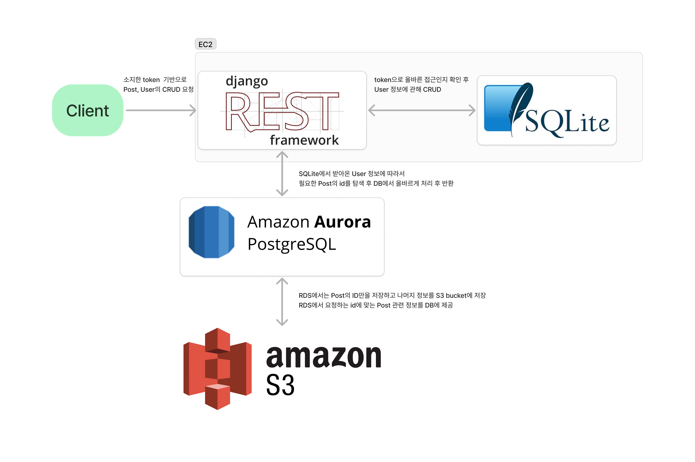

# Main_platfrom  
## 기능사항

### 회원 기능
- 회원 가입, 로그인, 로그아웃 등을 할 수 있으며 admin은 관리자 페이지에서 특정 회원의 권한을 수정 및 회원정보의 삭제가 가능하다.
- 회원 권한은 회원 정보를 Token 형식으로 받아 사용하며 Session 만료 기능을 따로 추가하지 않아 로그아웃 이전까지는 자동적으로 로그인되어 권한을 받은 상태를 유지한다.
- 기본적으로 학번, 이름, 비밀번호 3가지 정보만으로 회원가입을 하며 사용자가 회원가입을 신청한 뒤 어드민이 추가로 회원을 승인해야 로그인이 가능해진다.
### post CRUD 기능
- 로그인 여부에 상관없이 모든 종류의 게시판의 게시글을 확인 가능하며 첨부된 파일 또한 실행해보고 다운로드 받을 수 있다.
- 어드민이 아닌 경우에는 기본적으로 프로젝트, 구인구직, 예산신청 게시판에 글을 작성할 수 있으며 어드민을 제외하고 자신이 쓴 글 이외에는 수정, 삭제를 할 수 없다
- 구인구직 게시판은 자신이 진행하고자 하는 프로젝트를 설명하면서 프로젝트 인원을 모으는 게시판이고 예산신청 게시판은 프로젝트의 내용에 따라 어느정도의 예산이 필요한지 설명하여 예산에 대한 승인여부를 확인하는 게시판이다.
마지막으로 프로젝트 게시판은 실제로 프로젝트가 확정이 되면 진행되는 프로젝트를 확인할 수 있는 게시판이다.
- 공지사항과 명예의 전당은 어드민만이 작성 가능한 공간이다.
명예의 전당은 기존에 진행했던 프로젝트를 저장하는 곳이며 공지사항은 동아리 내의 행사, 회원들에게 알려야할 내용 등을 게시하는 곳이다
## TechStack
- OS
    - Ubuntu:22.04
     
- Language
    - Python:3.10.6
    - Node.js:20
     
- 그 외 사항은 깃허브의 requirements.txt 참고